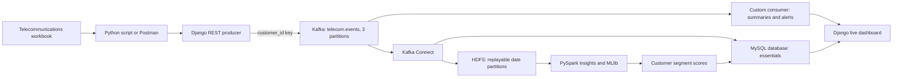

# Actual architecture

HDFS is the historical system of record for the full event stream. MySQL database `essentials` is deliberately limited to quick operational queries and dashboard-ready analytics. Spark reads HDFS directly rather than the operational database.
